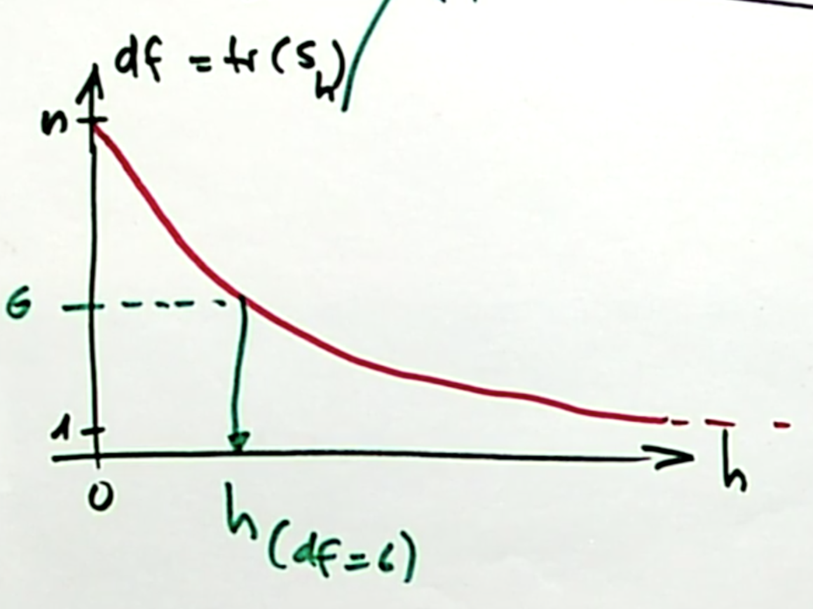

# Non-parametric Regression

We assume a model of the form 

$$ E[Y|X = x] = m(x)$$ 
which is more general than assuming $Y_i = m(x_i) + \epsilon_i$ since in the 
former, the noise does not have to be additive.
We can use Bayes' Theorem to deduce such an estimator $\hat{m}$ using 
density estimates of our predictor and response variable. In that sense,
non-parametric regression really builds on top of non-parametric density
estimation.

$$
\begin{split}
P[Y|X] &=  \frac{\mathbb{P}[X|Y]}{\mathbb{P}[Y]}\mathbb{P}[Y] \\ 
f_{Y|X} & = \frac{f_{X|Y}}{f_X}f_Y \\
f_{Y|X} & = \frac{f_{X, Y}}{f_X}   \;\;\;\;\;\;\;\;\;\;\;\;\;\;\;\;\;\;\;\;\; \text{|} \times y\\
f_{Y|X}y & = \frac{f_{X, Y}}{f_X}y \;\;\;\;\;\;\;\;\;\;\;\;\;\;\;\;\;\;\;\; \text{| taking the integral}\\
E[Y|X] & = \int \frac{f_{X, Y}}{f_X}ydy
\end{split}
$$
Whereas for $\hat{f}_{X, Y}$, we can use a product kernel. This formula 
simplifies quite a bit and yields the Nadaraja-Watson Kernel, which
is essentially just a weighted mean of response values.
$$\hat{m}(x) = \frac{\sum\limits_{i = 1}^n K\Big(\frac{x-X_i}{h}\Big)Y_i}{\sum\limits_{i = 1}^nK\Big(\frac{x-X_i}{h}\Big)} = \frac{\sum\mathcal{w}(x)_i Y_i}{\sum\mathcal{w}(x)_i} = \sum\limits_{i = 1}^n \tilde{\mathcal{w}}(x)_i Y_i = \tilde{\mathbf{w}}(x)'\mathbf{Y}$$
The weights $\tilde{\mathcal{w}}_i$ are normalized weights, i.e. 
$\tilde{\mathcal{w}}_i = \mathcal{w}_i / \sum\limits_{k = 1}^n \mathcal{w}_k$

## Alternative Interpretation
It can be easily shown that the solution corresponds to the following minimization
problem:

$$ m(x) = \arg\min\limits_{m_x} \sum\limits_{i = 1}^nK\Big(\frac{x-X_i}{h}\Big)\big(Y_i-m_x\big)^2 $$

We can interpret this as a weighted (local) regression. For a given
$x$, search for the best local constant $m_x$ that minimizes the 
weighted residual sum of squares the most. Residuals of data points close to 
$x$ get a high weight in this sum (via the kernel).

## The Bandwidth
The bandwidth parameter $h$ has a similar role as in non-parametric density 
estimation. Large $h$ implies very smooth functions, low variance, high bias.
Small $h$ on the other hand imply (more) erratic functions, high variance, 
low bias.

An interesting case is $h \rightarrow \infty$, for which all weights become 
equal. This corresponds to an estimator $m(x) = \bar{y}$, with one degree of 
freedom (see below). 


## Hat Matrix
As in chapter 1, we can also obtain a smoother matrix $S$ that maps the 
observed response values to the fitted values.
From above, we have:
$$\hat{y}_i = \tilde{\mathbf{w}}(x)'\mathbf{Y}$$


$$
\mathbf{\hat{Y}} = \mathcal{S} \mathbf{Y} = 
\begin{pmatrix}\hat{y}_1 \\\vdots\\\hat{y}_n\end{pmatrix} =
\begin{pmatrix}\tilde{\mathbf{w}}(x_1)'\\\vdots\\\tilde{\mathbf{w}}(x_n)'\end{pmatrix} 
\times \begin{pmatrix}y_1 \\\vdots\\y_n\end{pmatrix}
$$
Where $\tilde{\mathbf{w}}(x_1)'$ is a row vector of length $n$ with the
normalized kernel weights.

Let us adopt the notation from the script (kind of) and denote the kernel 
weight for observation $w_s$ on observation $x_r$ with $\tilde{w}_s(x_r)$, i.e.
$$ \tilde{w}_s(x_r) = \sum\limits_{s = 1} K\Big(\frac{x_r - x_s}{h}\Big) / \sum K(\cdot)$$
The smoother matrix from above can be rewritten as a matrix with scalar entries
instead of vectors 

$$ 
\begin{pmatrix}
\tilde{w}_1(x_1) \;\; \tilde{w}_2(x_1) \;\; \dots \;\;\tilde{w}_n(x_1) \\
\tilde{w}_1(x_2) \;\; \tilde{w}_2(x_2) \;\; \dots \;\;\tilde{w}_n(x_2)\\
\tilde{w}_1(x_3) \;\;\tilde{w}_2(x_3) \;\; \dots \;\;\tilde{w}_n(x_n) \\
\end{pmatrix} 
$$
So $[S]_{r, s} = \tilde{w}_s(x_r)$.

This matrix can be obtained easily by smoothing n unit vectors $u_{n \times 1}$. 
To obtain the j-th column, smooth the unit vector that has in the j-th position
a $1$ and all other positions $0$.
Let us assume equidistant x values. The following smoothed y values evaluated 
at all $x \in \{1, ..., n\}$ give the values for the first column of $S$.
```{r}
j <- 1
n <- 10
u <- rep(0, n)
u[j] <- 1
data <- data_frame(
  x = 1:n,
  y = u
)
ggplot(data, aes(x = x, y = y)) + geom_point() + geom_smooth(se = FALSE)
```

But why? The trick is that, since all but the j-th y value are zero, the fitted
value is just the noralized kernel weight.

$$\hat{m}(x_r)^{(j)} =  \frac{K\Big(\frac{x_r - x_j}{h}\Big)}{\sum K(\cdot)} = \tilde{w}_j(x_r)$$


## Degrees of Freedom
Note that we need a different measurement of degrees of freedom than the one
we used in the *parametric* case in chapter 1, where the degrees of freedom 
simply corresponded to the number of parameters used. As this is non-parametric
regression, we don't have parameters and hence cannot sum up the number of 
parameters to calculate the degree of freedom. Recall from chapter 1 that 
the trace of the smoothing matrix was equal to the number of parameters used:
$$tr(P) = \textbf{tr}(X(X'X)^{-1}X') = \textbf{tr}((X'X)^{-1}X'X) = \textbf{tr}(I_{p\times p}) = p$$
Hence, we can generalize the concept of degrees of freedom from number of 
parameters to the trace of the smoother matrix. For regression, the two 
coincide, for non-parametric methods, we get an estimate of the degrees of 
freedom only via the trace.

There is a one-to-one relationship between the degrees of freedom and the 
bandwidth parameter $h$, which we can show in a diagram:

```{r, echo = FALSE, out.width = "650px"}

```

This can be derived from the two extreme cases:

* $h \rightarrow \infty$ means all weights are equal, which means for each data
  point $x_i$, the fitted value $\hat{m}(x_i)$ is just the grand mean of $y$.
  This corresponds to one degree of freedom.
  
$$\hat{m}(x) = \bar{y} $$
  
* $h \rightarrow 0$. If we assume $n$ distinct, equi-spaced $x_i$ values, then
  the fitted values in the neighborhood of  $\hat{m}(x_i)$ are just the 
  observed response value $y_i$, since all weights for points other than $y_i$ 
  are zero. Or to be more precise: If the distance between
  neighboring points is $\eta$, then, for  $h \leqslant \eta$ :
  
  $$ \hat{m}(x) = y_{i^*} \;\;\ \text{with} \;\; i^* =  
  \arg\min\limits_{0 \leqslant i \leqslant n} |x - x_i| $$
  This corresponds to $n$ degrees of freedom.
* We can interpolate between these two extreme cases in a monotone way.

For non-parametric density estimation, this is very similar except that the 
esimates around a data point would not be constant for very small $h$, but the 
weigth the kernel takes for that value of $\frac{x-x_i}{h}$
because all but one of the summands are zero in 
$\sum\limits_{i = 1}^n K\Big(\frac{x -x_i}{h}\Big)$.


### Applications

There are two main applications for the degree of freedom:

- **As a tuning parameter**. For every $h$, we can find the corresponding degrees of 
  freedom or more interestingly - for every(desired) degree of freedom, we can 
  find an $h$. Instead of varying $h$ directly, we can vary the degrees of 
  freedom, which are directly **comparable** accross different techniques.
  We can compare OLS with different 
  kernel smoothers, splines etc. (see below), which is not possible with $h$ 
  alone. 
- **For inference**. For unbiased estimators (such as the variance of the 
  residuals), we need the degrees of freedom (see below).

## Inference 

As with parametric regression, we want to do inference. Not on any parameters
(since there are none), but on the fitted values. First and foremost, we want
to obtain confidence intervals for the regression line, that is, obtaining
point-wise lower and upper bounds of the confidence internal
$$ I_i = \hat{m}(x_i) ± 1.96 *\hat{sd}(\hat{m}(x)) $$
Which holds because the fitted value is asymtotically normally distributed.
We know already how to obtain $\hat{m}(x)$, now we need to find the standard
deviation of the fitted values.

From the fundamental equation $Cov(\mathbf{A}x) = \mathbf{A} Cov(x) \mathbf{A}'$,
we get
$$ \text{Cov}(\hat{m}(x)) = \text{Cov}(\mathcal{S}\mathbf{y}) = 
\mathcal{S} \text{Cov}(y) \mathcal{S}' = \sigma_\epsilon^2\mathcal{SS}'
\;\;\;\;\;|\;\; \text{since Cov}(y) = \text{Cov}(\epsilon)$$ 
Which is a $p\times p$ matrix. For a specific data point $x_i$, we have
$$ \text{Var}(\hat{m}(x_i))= \text{Cov}(\hat{m}(x_i),  \hat{m}(x_i)) = \sigma_\epsilon^2 (\mathcal{S} \mathcal{S}')_{ii} $$

Now, we only need to estimate $\sigma^2_\epsilon$. Using the generalized 
method to compute degrees of freedom, we can use the following estimator:

$$ \hat{\sigma}_\epsilon^2 = \frac{1}{n-\textbf{tr}(\mathcal{S})}
\sum\limits_{i = 1}^n (Y_i - \hat{m}(x_i))^2$$


## Local Polynomial Estimator

Expanding on the formulation of the Nadaraya-Watson Kernel as a weighted
least square problem, we can use centered polynomials to approximate $y_i$
instead of a local constant $\hat{m}_x$. That is, computing our estimator as

$$\hat{m}(x) = \arg\min\limits_{m_x} \sum\limits_{i = 1}^nK\Big(\frac{x-X_i}{h}\Big)
\big(Y_i-\beta_0 + \beta_1 (x_i -x) + ... \beta_{p-1} (x_i-x)^{p-1}\big)^2 $$ 

This has the advantage of yielding a *lolcal linear* regression curve at the
borders, whereas the Nadaraya-Watson Kernel yields *local constant* regression
curves in these regions (since at the border, no new points are are taken into
account).

Another advantage is that we can find derivaties of the regression estimate at
each point easily.
