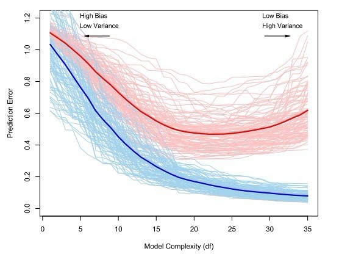

# Cross Validation

## Motivation and Core Idea
Cross-validation is a tool for estimating the performance of an algorithm 
on new data points, the so-called the generalization error. An estimate of the
generalization allows us to do two important things:

* Tuning the parameters of a statistical technique.
* Comparing statistical techniques with regard to their accuracy.

If we use the **training data** to evaluate the performance of an algorithm, 
this estimate will be over-optimistic because an estimator is usually obtained
by minimizing some sort of error in the training data. Therefore, we use a
separate data pool, called the **test data** to evaluate the performance out of
sample.
Consider the regression function estimate $\hat{m}$ based on a sample 
$(X_1, ..., X_n.)$. By increasing the number of parameters in the model and by 
allowing for interactions between them, we can make the regression model fitting
arbitrarily well to the data. However, such an extremely complex model will not
perform as well with new data, that is, will not generalize well to other 
data sets, since we essentially modeled also a lot of noise. 
To estimate the performance of an algorithm on a new sample, we introduce the 
following notation:
$$ l^{-1}\sum\limits_{i = 1}^l\rho(Y_{new, i}, \hat{g}(X_{new, i}))$$
Where $\rho$ is a loss function to be evaluated on the new data points 
$(Y_{new, 1}, ..., Y_{new, l})$ and the prediction made for 
$(X_{new, 1}, ..., X_{new, l})$ with the function $\hat{g}$, which was estimated
from the training data $(X_1, ..., X_n)$. When $l$ gets large, this approximates 
the **test error** 
$$\mathbb{E}_{(X_{new}, Y_{new})}[\rho(Y_{new}, \hat{m}(X_{new})]$$
which is still a function of the training data (since it is conditional on the 
training data). Note that the *test error* is not the same as the 
**generalization error**. The latter is an expectation over both the training
and the test data. The typical relationship between the test error and the 
training error is depicted in the figure below.

```{r,echo=FALSE, out.width = "650px"}

```

The optimal model complexity is at around $20$ degrees of freedom. With more
degrees of freedom, the test set error increases again. We start to model 
noise. This is also called overfitting.

## Loss Function
Depending on the application, 
one can imagine different loss-functions. For example the squared deviance from
the *true* value is often used, i.e. 
$$n^{-1}\sum\limits_{i = 1}^n\rho(Y_i, \hat{m}(X_i)) = n^{-1}\sum\limits_{i = 1}^n(Y_i - \hat{m}(X_i))^2$$ Hence, larger deviance is penalized over-proportionally.
For classification, one often uses the zero-one error, i.e. 
$$n^{-1}\sum\limits_{i = 1}^n1_{\hat{m}(X_i) \neq Y_i}$$
However, it might also be appropriate to use asymmetric loss functions if
false negatives are worse than false positives (i.e. for cancer tests).

## Implementations

There are different ways to do cross validation while adhering to the principles
introduced above.

### Leave-one-out

* Use all but one data point to construct a model and predict on the remaining
  data point.
* Do that $n$ times until all $n$ points were used for prediction once.
* Compute the test error as an average over all n errors measured, i.e


$$n^{-1}\sum\limits_{i = 1}^n \rho{(Y_{i}, \hat{m}_{n-1}^{-i}(X_i)})$$
And use that as an approximation of the *generalization error*.

## K-fold Cross-Validation
This method is best explained with a picture.
```{r, echo = FALSE, out.width = "650px"}
knitr::include_graphics("figures/k_fold_cv.png")
```

Here, one splits the data set into k equally (or as equal as possible) sized folds. Then, the idea is
to use all $k-1$ folds to build a model and the remaining fold to evaluate the 
model. Then, we average the $k$ estimates of the generalization error. Or in 
mathematical notation:

$$K^{-1} \sum\limits_{k = 1}^K |B_k|^{-1} \sum\limits_{i \in B_k}\rho({Y_{i}, \hat{m}^{-B_k}_{n-|B_k|}(X_i))}$$ 

Note that leave-one out cv is the same as k-fold cross validation with $=n$.

### Random Division into test and training data set
The problem of K-fold cross-validation is that it depends on **one realization**
of the split into k folds. Instead, we can generalize leave-one-out to 
leave-d-out. That means, we remove $d$ observations from our initial data, 
apply our estimation procedure and evaluate on the $d$ observations.
$$\hat{\theta}^{-C_k}_{n-k} \;\;\; \text{for all possible subsets}\;\; C_k, \;\; k=1, ..., {\binom{n}{d}}$$ 
The generalization error can be estimated with
$${\binom{n}{d}}^{-1}\sum\limits_{k = 1}^{\binom{n}{d}} d^{-1}\sum\limits_{i \in C_k} \rho(Y_i, \hat{m}^{-C_k}_{n-d}(X_i))$$
For $d > 3$, the computational burden becomes immense. For that reason, instead
of considering all ${\binom{n}{d}}$ sets, we can uniformly draw $B$ sets 
($C_1^*, ... C_B^*$) from $C_1, ..., C_{\binom{n}{d}}$ *without replacement*.
For $B=\binom{n}{d}$, we obviously get the full leave-d-out solution. The
**computational cost** for computing such an approximation to the leave-d-out
is linear in $B$ (since evaluating is almost for free). For leave-one-out, the
cost is linear in $n$ in the same way. Hence, the stochastic approximation for
leave-d-out can be even smaller than for leave-one-out if $B < n$.

## Properties of the different schemes

We can try to say something about both bias and variance of the cv schemes introduced above.

* **leave-one-out** is an asymptotically **unbiased** estimator for the generalization 
  error and the true prediction. However, we use a sample size $n-1$ instead of 
  $n$, which causes a slight bias (meaning we have less data as we do in a real 
  world scenario, which most likely makes the CV score a tiny little bit worse 
  than it should be). Because the training sets are very similar to each other
  the leave-one-out scheme has a **large variance**.
* **leave-d-out** has a **higher bias** than leave-one-out because the sample size is
  even smaller than $n-1$ (for $d>1$). However, since we aggregate over more
  ($\binom{n}{d}$ instead of $n$) cv scores, which can be shown to decrease the
  variance of the final cv estimator.
* **k-fold** cv has a **higher bias** than both leave one out.

## Shortcuts for (some) linear fitting operators
Leave-one-out cv score for some linear fitting procedures such as least squares
or smoothing spline can be computed via a shortcut when our loss function is
$\rho(y, \hat{y}) = |y-\hat{y}|^2$. In particular, we can compute the estimator
for such a linear fitting procedure **once**, compute the linear fitting operator
$S$, which satisfies $\mathbf{\hat{Y}} = \mathbf{SY}$ and plug it in this formula:
$$n^{-1}\sum\limits_{i = 1}^n \Bigg(\frac{Y_i - \hat{m}(X_i)}{1-S_{ii}}\Bigg)^2$$
Computing $\mathbf{S}$ requires $O(n)$ operations (see exercises).

You can implement that easily in R without a loop or anything - because the 
functions are vectorized:

```{r, eval = FALSE}
cv_short_cut <- function(x, y, df, S, fit_fun = reg.fcn.loess) {
  fit <- fit_fun(x, y, x, df = df.nw)
  mean(((y-fit)/(1 - diag(S)))^2)
}
```

As simple as that.
Historically, it has been computationally easier to compute the trace of 
$\mathbf{S}$ so there is also a quantity called generalized cross validation
(which is a misleading terminology), which coincides with the formula above in 
certain cases.


## Isolation of each cross validation sample

Note that it is very important to re-estimate all parameters relevant for the
cross validation within every sample. Otherwise, our estimates will be too
optimistic. This problem was mentioned in the exercise series 10.
Specifically, the taks was to train a tree algorithm. For every sample, we had
to determine the optimal cp individually (via cross validation in the cross
validation so to speak). Why not using the cp estimated from the whole data
set? Because then, we would use information from samples other than the
current cv batch and then evaluating the performance of the model based on the
cv batch and the *global* parameter to evaluate our model performance. This
contradicts the idea of cross validation and is similar to using the training
sample to estimate the performance of a model. 

## Examples with R

In the remainder of this chapter, we will discuss the two important applications
of cross validation: Estimation of the GE and parameter tuning.

### Application 1: Estimating the generalization error

Key concepts to do CV are

* Do not split the data, split the indices of the data and work with them if 
  ever possible and subset the data. `sample()` is your friend.
* use `purrr::map()`, `purrr::map_df()` and friends to "loop" over data. This is
  preferred over base R `lapply` / `mapply` / `Map` since it has a more coherent 
  argument structure (consistent argument positioning, no strange `MoreArgs` 
  arguments, pipable etc.)
* you can simplify structures with `purr::flatten_dbl()` and friends.
* Always work with lists, never work with data frames of indices. The reason is
  that data frames have structural constrains (all columns must have same number
  of elements) that are not natural in some situations. For example, 
  out-of-bootstrap cv *does* have the same number of observations in the 
  training set, but not in the test set. 
* In conjunction with `sample()`, you can use `purrr::rerun` or `replicate` to
  create lists of indices.
* To get *the other part of the sample*, you can use negative indices or 
  `setdiff()`.
* use helper function to solve "the small problems in the big problem".

Let's first declare our functions.
```{r, results=FALSE}
library("purrr")
data(ozone, package = "gss")

#' Estimate the generalization error of a ridge regression
#' @param test Test indices.
#' @param train Train indices.
#' @param .data The data.
#' @param lamda The lamda parameter for the ridge regression.
ge_ridge <- function(test, train, .data, lambda) {
  fit <- MASS::lm.ridge(upo3~., 
                  lambda = lambda,
                  data = .data[train,])
  pred <- as.matrix(cbind(1, .data[test, -1])) %*% coef(fit)
  mean((pred - .data[test,]$upo3)^2)
}


##  ............................................................................
##  functions to return list with indices                                   ####


get_boostrap_mat <- function(B, n) {
  rerun(B, sample(n, n, replace = TRUE))
  
}

get_all_mat <- function(B, n) {
  rerun(B, 1:n)
}

get_complement <- function(mat, n){
  map(mat, ~setdiff(1:n, .x))
}

get_k_fold_test <- function(k, n) {
  step <- round(n/k)
  current <- list()
  for (i in (0:(k-1) * step + 1))  {
    current <- append(
      current, 
      list(i:(min(i+step-1, n)))
    )
  }
  current
}
```

Now, let us apply the functions for three cv schemes to estimate the generalization
error.
```{r}
##  ............................................................................
##  boostrap                                                                ####
# use boostrap sample to train, use all to test
n <- nrow(ozone)
train <- get_boostrap_mat(10, n)
test <- get_all_mat(10, n)
bs <- map2_dbl(test, train, ge_ridge, .data = ozone, lambda = 5)


##  ............................................................................
##  10-fold                                                                 ####
test <- get_k_fold_test(10, n)
train <- map(test, ~setdiff(1:n, .x))
kfold <- map2_dbl(test, train, ge_ridge, .data = ozone, lambda = 5)

##  ............................................................................
##  out-of-boostrap                                                         ####
train <- get_boostrap_mat(10, n)
test <- map(test, ~setdiff(1:n, .x))
oob <- map2_dbl(test, train, ge_ridge, .data = ozone, lambda = 5)
```

The results are as follows:
```{r}
out <- cbind(bs, kfold, oob) %>%
  as_data_frame() %>%
  gather(key, value)

ggplot(out, aes(y = value, x = key)) + 
  geom_boxplot()
```


### Application 2: Parameter Tuning
We want to use the scheme k-fold cross validation for parameter tuning with a
lasso. We first calculate the test set error for *one* value of lamda (as we
did above). Then, change the value of lamda and recompute the model and then
test set error, so that the test set error becomes a function of lamda, as
depicted below. 

```{r, out.width="650px", echo=FALSE}
knitr::include_graphics("figures/lasso_cv.png")
```

Then pick an optimal lamda, e.g. the one with the lowest test error (a bit
arbitrary) or one according to some other rule (e.g. pick the least complex
model that is within one standard error of the best model).

```{r}
#' Given lambda, compute the test set error with k folds
find_lambda_kfold_one <- function(lambda, k, n, .data, ...) {
  x_test <- get_k_fold_test(k, n)
  x_train  <- get_complement(x_test, n)
  map2_dbl(x_test, x_train, ge_ridge, lambda = lambda, .data = .data, ...) %>%
    mean()
}

#' Given a sequence of lambdas, return the corresponding test set errors
find_lambda_kfold <- function(seq, k, .data) {
  cv <- map_dbl(seq, find_lambda_kfold_one, 
                k = k, n = nrow(.data), .data = .data)
  results <- data_frame(lambda = seq, cv_score = cv)
  results
}

```

We are almost done. Let us now compute the test set error that we use as an 
approximation of the generalization error and plot it against different 
values of lamda.
```{r}
find_lambda_kfold(seq = seq(5, 30, by = 3), 100, ozone) %>%
  ggplot(aes(x = lambda, y = cv_score)) + 
  geom_line()


```

That looks reasonable. We could improve on that by also showing the distribution
of the test set error at various lambadas. This could by done by altering 
`find_lambda_kfold_one()` to not return the mean, but also the upper and lower 
95% confidence interval.
