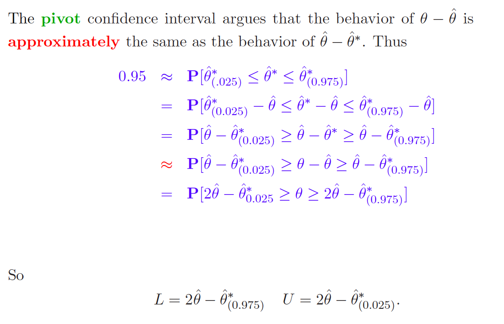

# Bootstrap

* Bootstrap can be summarized as "simulating from an estimated model"
* It is used for inference (confidence intervals / hypothesis testing)
* It can also be used for estimating the predictive power of a model
  (similarly to cross validation) via out-of-bootstrap generalization error
  
## Motivation
Consider i.i.d. data. 
$$ Z_1, .. Z_n \sim\ P \;\; with \; \;Z_i = (X_i, Y_i)$$ 
And assume a statistical procedure
$$ \hat{\theta} = g(Z_1, ..., Z_n) $$
$g(\cdot)$ can be a point estimator for a regression coefficient, a 
non-parametric curve estimator or a generalization error estimator based on 
one new observation, e.g.
$$ \hat{\theta}_{n+1} = g(Z_1, ..., Z_{new}) = (Y_{new} - m_{Z_1, ..., Z_{new}}(X_{new})^2 $$
To make inference, we want to know the distribution of $\hat{\theta}$. For some
cases, we can derive the distribution analytically if we know the distribution
$P$. The central limit theorem states that the sum of random variables 
approximates a normal distribution with $n \rightarrow \infty$. Therefore, we
know
$$ \hat{\theta}_{n \rightarrow \infty} = n^{-1}\sum x_i \sim N(\mu_x, \sigma_x^2 / n) $$ 
for *any* $P$. However, if $\hat{\theta}$ is not a sum of random variables, 
and the CLT does not apply, it's not as straightforward to obtain the 
distribution of $\hat{\theta}$. Also, if $P$ is not the normal distribution, 
but some other distribution, we can't find the distribution of $\hat{\theta}$
easily. The script mentions the median estimator as an example for which the 
variance already depends on the density of $P$.
Hence, deriving properties of estimators analytically, even the asymptotic 
ones only, is a pain.
Therefore, if we knew $P$, we could simply simulate many times and get the 
distribution of $\hat{\theta}$ this way. That is,
draw many $(X_i, Y_i)$ from that distribution and compute $\hat{\theta}$ for 
each draw. 

The problem is that we don't know $P$. But we have a data sample
that was generated from $P$. Hence, we can instead take the **empirical** 
distribution $\hat{P}$that places probability mass of $1/n$ on each observation, draw a
sample from this distribution (which is simply drawing uniformly from our 
sample with replacement) and compute our estimate of interest from this sample.
$$ \hat{\theta}^{*} = g({Z_1}^{*}, ..., {Z_{new}}^{*})$$
We can do that many times to get an approximate distribution for $\hat{\theta}$.
A crucial assumption is that $\hat{P}$ reassembles $P$. If our data is not 
i.i.d, this may not be the case and hence bootstrapping might be misleading.
Below, we can see that i.i.d. sampling reassembles the true distribution quite 
well, whereas biased sampling obviously does not. We produce a sample that 
places higher probability mass to the large (absolute) values.
```{r, echo=FALSE, message=FALSE}
library("tidyverse")
pop <- data_frame(pop = rnorm(10000) * 1:10000) 
iid <- sample(pop$pop, 1000) # sample iid

# sample non-iid: sample is biased towards high absolute values
ind <- rbinom(10000, size = 1, prob = seq(0, 1, length.out = 10000)) 
not_iid <- pop$pop[as.logical(ind)] # get sample
not_iid <- sample(not_iid, 1000) # reduce sample size to 1000

out <- data_frame(iid = iid, not_iid = not_iid) %>%
  gather(type, value, iid, not_iid)
ggplot(out, aes(x = value, color = type)) + 
  geom_density() + 
  geom_density(aes(x = pop, color = NULL), data = pop)

```

We can summarize the bootstrap procedure as follows.

* draw a bootstrap sample ${Z_1}^{*}, ..., {Z_{new}}^{*}$
* compute your estimator $\hat{\theta}$ based on that sample.
* repeat the first two steps $B$ times to get bootstrap estimators 
$\hat{\theta}_1, ..., \hat{\theta}_B$ and therefore an estimate of the 
  distribution of $\hat{\theta}$.
  
Use the $B$ estimated bootstrap estimators as approximations for the bootstrap 
expectation, quantiles and so on.
$\mathbb{E}[\hat{\theta}^*_n] \approx B^{-1}\sum\limits_{j = 1}^n \hat{\theta}^{* j}_n$

## The Bootstrap Distribution
With $P^*$, we denote the bootstrap distribution, which is the conditional 
probability distribution introduced by sampling i.i.d. from the 
empirical distribution $\hat{P}$. Hence, $P^*$ of ${\hat{\theta}}^*$ is the 
distribution that arises from sampling i.i.d. from $\hat{P}$ and applying the 
transformation $g(\cdot)$ to the data. 
Conditioning on the data allows us to treat $\hat{P}$ as fixed. 


## Bootstrap Consistency
The bootstrap is is called consistent if 
$$ \mathbb{P}[a_n(\hat{\theta} - \theta) \leq x ] - \mathbb{P}[a_n(\hat{\theta}^* - \hat{\theta}) \leq x ] \rightarrow 0$$
Consistency of the bootstrap typically holds if the limiting distribution is
normal and the samples $Z_1, .., Z_n$ are i.i.d. Consistency of the bootstrap
implies consistent variance and bias estimation:

$$ \frac{Var^* (\hat{\theta}^*)}{Var(\hat{\theta})} \rightarrow 1$$
$$ \frac{\mathbb{E}^* (\hat{\theta}^*) - \hat{\theta}}{\mathbb{E}(\hat{\theta}) - \theta} \rightarrow 1$$
You can think of $\theta$ as the real parameter and $\hat{\theta}$ as the estimate
based on a sample. Similarly, in the bootstrap world, $\hat{\theta}$ is the *real*
parameter, and $\hat{\theta}^*_i$ as an estimator of the *real* parameter 
$\hat{\theta}$. The bootstrap world is an analogue of the real world. 
So in our  bootstrap simulation, we know the *true* parameter 
$\hat{\theta}$. From our simulation, we get many $\hat{\theta}^*_i$ and can 
find the bootstrap expectation
$\mathbb{E}[\hat{\theta}^*_n] \approx B^{-1}\sum\limits_{j = 1}^n \hat{\theta}^{* j}_n$.
The idea is now to generalize from the *boostrap* world to the *real* world, i.e.
by saying that the relationship between $\hat{\theta}^*$ and $\hat{\theta}$ is
similar to the one between $\hat{\theta}$ and $\theta$.

A simple trick to remember all of this is:

 * if there is no hat, add one
 * if there is a hat, add a star.
 
## Boostrap Confidence Intervals
```{r, echo=FALSE}

```

Note that there confidence intervals are not simply taking the quantiles of
the bootstrap distribution. The trick is really to make use of the analogy 
between the *real* world and the *boostrap* world. So when we see our bootstrap
expectation $\mathbb{E}[\hat{\theta}^*_n]$ is way higher than $\hat{\theta}$, 
then we also should believe that our $\hat{\theta}$ is higher than $\theta$. 
The above procedure accounts for that.

## Boostrap Estimator of the Generalization Error

We can also use the bootstrap to estimate the generalization error. 
$$ \mathbb{E}[\rho(Y_{new}, m^*(X_{new}))] $$

* We draw a sample $(Z_1, ..., Z_n, Z_{new})$ from $\hat{P}$
* We compute the bootstrapped estimator $m(\cdot)$ based on the sample
* We estimate $\mathbb{E}[\rho(Y_{new}, m^*(X_{new}))]$, which is with respect 
  to both training and test data.

We can rewrite the generalization error as follows:
$$ \mathbb{E}[\rho(Y_{new}, m^*({X_{new}}^*))] = \mathbb{E}_{train}[E_{test}[\rho({Y_{new}}^*, m^*({X_{new}}^*))| train]]$$
Conditioning on the training data in the inner expectation, $m(\cdot)$ is 
non-random / fixed. The only random component is ${Y_{new}}^*$. Since we draw 
from the empirical distribution and place a probability mass of $1/n$ on every
data point. we can calculate the inner (discrete) expectation easily via 
$\mathbb{E}(X) = \sum\limits_{j = 1}^n p_j * x_j = n^{-1} \sum\limits_{j = 1}^n x_j$.
The expectation becomes. 
$$ \mathbb{E}_{train}[n^{-1}\sum\rho(Y_{i}, m^*(X_{i}))] =  n^{-1}\sum\mathbb{E}[\rho(Y_{i}, m^*(X_{i}))]$$

We can see that there is no need to draw $Z_{new}$ from the data. The final
algorithm looks as follows:

* Draw $Z_1, ..., Z_{N}$
* compute bootstrap estimator $\hat{\theta}^*$
* Evaluate this estimator on all data points and average over them, i.e 
  $err^* = n^{-1} \sum \rho(Y_i, m^*(X_i))$
* Repeat steps above B times and average all error estimates to get the
  bootstrap GE estimate, i.e. 
  $GE^* = B^{-1} \sum err_i$


## Out-of-Boostrap sample for estimating the GE
One can crises 
