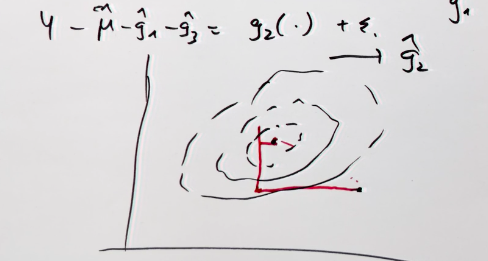

## Additive Models 
### Structure
One assumption we can make is to assume a particular functional form of 
$g(\cdot)$, namely an *additive*. That is 
$$g_{add}(x) = \mu + \sum\limits_{j = 1}^pg(x_j) $$ $E[g(x_j)] = 0$ is required to
make the model identifiable only. Note that we have not placed any assumption
on $g(x_j)$ yet, that is, $g(x_j)$ can be fully non-parametric, but each
dimension is mapped separately. In other words every $g(x_j) \;\; j = 1, ..., p$
models one input dimension and mapping of input to output is obtained by summing
the transformed inputs up. This eliminates the possibility of **interaction
effects**.

### Fitting Procedure 
Additive models can be estimated with a technique called back-fitting.
However, the model can be estimated with any non-parametric method for
one-dimensional smoothing. Here is the recipe:

* since we assume an additive model, we need to initialize all $p$ components of
  it with zero, that is setting $g_j(\cdot) = 0 \;\; j = 1,..., p$ plus setting 
  $\mu = n^{-1}\sum Y_i$. * Then we fit one-dimensional smoother repeatedly, 
  that is solving the one-dimensional smoothing problem 
  $Y - \mu - \sum\limits_{j \neq k}\hat{g}_j = \hat{g}_j(x_j)$, or put 
  differently $\hat{g}_j = S_j(Y - \mu1 - \sum\limits_{j \neq k}g_j)$. 
  This has to be done repeatedly for $j = 1, ..., p, 1, ..., p$ etc. 
* Stop iterating when functions don't change much anymore, that is, when the 
  following quantity is less than a certain tolerance. 
  $$\frac{|\hat{g}_{i, new} - \hat{g}_{i, old}|}{|\hat{g}_{i, old}|}$$ 
* Normalize the functions by subtracting the mean from them: 
  $$\tilde{g}_j = \hat{g}_j - n^{-1} \sum\limits_{i = 1}^n \hat{g}_j(x_{ij})$$

Back-fitting is a **coordinate-wise** optimization method that optimizes one 
coordinate at the time (one $g(\cdot)$, but can be more than one parameter), which
may be slower in convergence than a general gradient descent that optimizes all
directions simultaneously but also more robust.

```{r, echo=FALSE} 
 
```

```{r, echo=FALSE, eval=FALSE} 
# To Do: Think about additive models for classification. 
``` 

### Additive Models in R 
You can use the package **mgcv** 
```{r} 
data("ozone", package = "gss") 
fit <- mgcv::gam(upo3 ~ s(vdht) + s(wdsp) + s(hmdt) + s(sbtp), 
           data = ozone) 

plot(fit, pages = 1) 
``` 

You can see
that vdht enters the model almost linearly. That is, with an increase of one
unit of vdht, the predicted 03 value increases linearly. sbtp is different.
Depending on the value of sbtp, the increase in the predicted value is
different. Low sbtp values hardly have an impact on the response, higher values
do.
