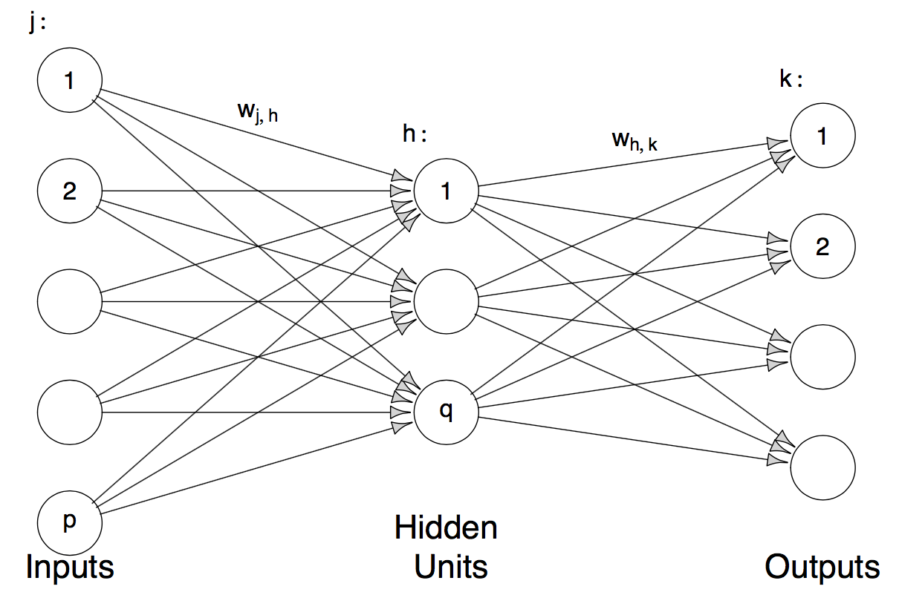

## Neural Networks 
Neural networks are high-dimensional non-linear regression
models. The way it works is best illustrated with a picture.

```{r, echo=FALSE} 
 
```

This is a neural network with one hidden layer, $p$ input layers and $q$ output
layers. Mathematically speaking, the model is: 
$$ g_k(x) = f_0\Big(\alpha_k +
\sum\limits_{h = 1}^q w_{ij} \phi(\tilde{\alpha}_h + \sum\limits_{j = 1}^p
w_{jh}x_j)\Big)$$ 
Where $\phi(x)$ is the sigmoid function $\frac{exp(x)}{1 +
exp(x)}$, $f_0$ is the sigmoid function for classification and the identity for
regression. In the case of regression $k = 1$ is used, for classification we use
$g_0, ..., g_{J-1}$ and then use the Bayes classifier $\mathcal{\hat{C}(x)} =
\arg\max\limits_{0<j<J-1} g_j(x)$ (is that correct?), which is called the
softmax in the neural network literature.

### Fitting Neural Networks (in R) 
The `nnet` function from the package with the
same name basically uses gradient descent to maximize the likelihood. It is
important to first scale the data so the gradient descent does not get stuck in
flat regions of the sigmoid function. 
```{r, results=FALSE, message=FALSE} 
set.seed(22) 
data("ozone", package = "gss") 
unloadNamespace("MASS")
scaled <- ozone %>% 
  select(-upo3) %>% 
  scale() %>% 
  as_data_frame() %>% 
  mutate(log_upo3 = log(ozone$upo3))

fit <- nnet::nnet( log_upo3 ~., data = scaled, 
                   size = 3, # how many nodes in the *one* hidden layer. 
                   decay = 4e-4, # regularization. Multiply weights by 1 - decay after 
                   # gradient step. 
                   linout = TRUE, # linear output units (refers to f0?). 
                   skip = TRUE, # add skip-layer connections between output and input. 
                   maxit = 500 ) 
```

The weights between the nodes are:

```{r} 
summary(fit) 
```

The in-sample MSE for the regression case is

```{r} 
mean(residuals(fit)^2) 
```
